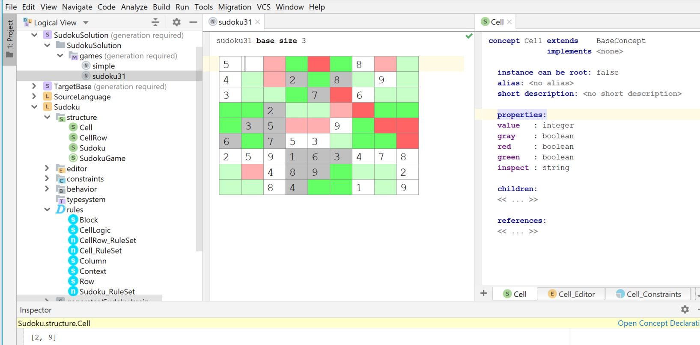

### Sudoku - a Sudoku puzzle solver
The Sudoku example is a more sophisticated example that uses Rules to solve a Sudoku puzzle.

The Sudoku Structure and Rules are defined in the Sudoku Language.

There are two example Sudoku game instances delivered in the SudokuSolution/games folder.

The sudoku31 example:

